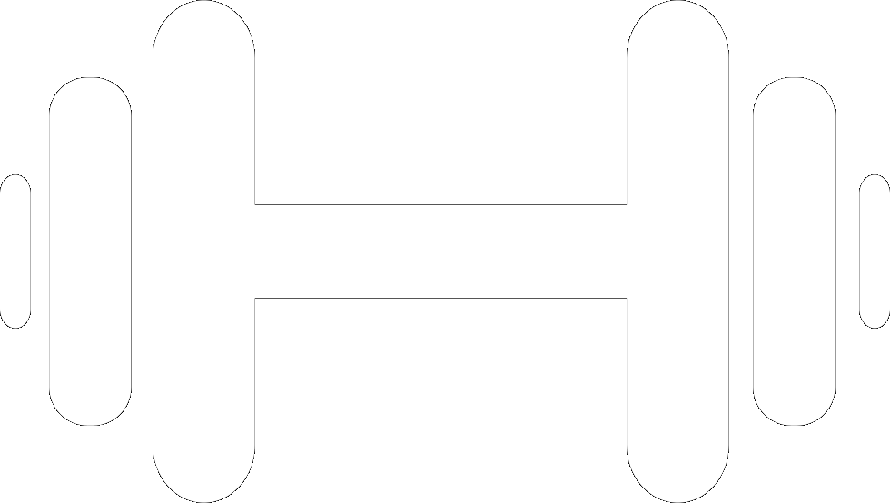

<a name="readme-top"></a>

<!-- PROJECT SHIELDS -->
<!--
*** I'm using markdown "reference style" links for readability.
*** Reference links are enclosed in brackets [ ] instead of parentheses ( ).
*** See the bottom of this document for the declaration of the reference variables
*** for contributors-url, forks-url, etc. This is an optional, concise syntax you may use.
*** https://www.markdownguide.org/basic-syntax/#reference-style-links
-->
<!-- [![Contributors][contributors-shield]][contributors-url]
[![Forks][forks-shield]][forks-url]
[![Stargazers][stars-shield]][stars-url]
[![Issues][issues-shield]][issues-url]
[![MIT License][license-shield]][license-url] -->


<!-- PROJECT LOGO -->
<br />
<div align="center">
  <a href="https://github.com/d-x-s/airon-fitness">
    
  </a>

  <h3 align="center">AIron Fitness</h3>

  <p align="center">
    AI-powered fitness app to help you kickstart your training journey.
    <br />
    <a href="https://github.com/d-x-s/airon-fitness"><strong>View Demo »</strong></a>
    <br />
  </p>
</div>


<!-- TABLE OF CONTENTS -->
<details>
  <summary>Table of Contents</summary>
  <ol>
    <li>
      <a href="#about-the-project">About The Project</a>
      <ul>
        <li><a href="#the-team">The Team</a></li>
        <li><a href="#built-with">Built With</a></li>
      </ul>
    </li>
    <li><a href="#minimal-requirements">Minimal Requirements</a></li>
    <li><a href="#standard-requirements">Standard Requirements</a></li>
    <li><a href="#stretch-goals">Stretch Goals</a></li>
    <li><a href="#license">License</a></li>
    <li><a href="#acknowledgments">Acknowledgments</a></li>
  </ol>
</details>


<!-- ABOUT THE PROJECT -->
## About The Project

[![Product Name Screen Shot][product-screenshot]](https://github.com/d-x-s/airon-fitness)

Introducing AIron Fitness, an innovative fitness companion designed to support individuals on their personal fitness journey. AIron Fitness utilizes artificial intelligence to deliver customized fitness plans tailored to each user's goals and preferences. Whether you're a beginner looking to start a fitness routine or an experienced enthusiast aiming to level up, AIron Fitness has got you covered.

With AIron Fitness, users can create their profiles, input their fitness goals, and receive a comprehensive fitness plan perfectly suited to their needs. The platform stores valuable user data, including personal profiles and fitness progress, allowing users to track their journey and witness their achievements over time.

But AIron Fitness goes beyond just providing static plans. Time permitting, additional functionality such as computer vision can be incorporated to enhance the user experience. Through computer vision, the platform can analyze and provide real-time feedback on exercise form and technique, ensuring users perform exercises correctly and maximize their results. Furthermore, dynamic fitness plans can be generated based on live user data, allowing the platform to adapt and optimize the workout regimen as users progress.

AIron Fitness empowers individuals to take control of their fitness goals and enjoy a personalized fitness experience. Say goodbye to generic workouts and hello to a tailored fitness solution with AIron Fitness by your side.

<p align="right">(<a href="#readme-top">back to top</a>)</p>


<!-- GROUP -->
## The Team

[@Davis Song](https://www.linkedin.com/in/davissong/)<br>
[@Jack Ji](https://www.linkedin.com/in/jack-ji-5643a011a/)<br>
[@Kenny Cheng](https://www.linkedin.com/in/kennyjhcheng/)<br>
[@Kevin Chung](https://www.linkedin.com/in/kevin-chung07/)<br>
[@Kevin Wu](https://www.linkedin.com/in/kevin-wu1/)<br>


<p align="right">(<a href="#readme-top">back to top</a>)</p>


## Built With
* [![NPM][NPM]][NPM-url]
* [![Node.js][Node.js]][Node-url]
* [![React][React.js]][React-url]
* [![MaterialUI][MaterialUI]][MaterialUI-url]
* [![MongoDB][MongoDB]][MongoDB-url]
* [![Express][Express.js]][Express-url]
* [![Redux][Redux]][Redux-url]
* [![OpenAI][OpenAI]][OpenAI-url]
* [![JWT][JWT]][JWT-url]


<p align="right">(<a href="#readme-top">back to top</a>)</p>


<!-- Roadmap -->
### Minimal Requirements
- [x] A user can create a profile that can be saved
    - [x] Develop Frontend UI
    - [x] Fetch/Upload Profile Image
    - [x] Store input JSON (Name, Age, Email, Birthdate, Image) in database
    - [x] API Integration - Birthdate Entry
    - [x] Investigate Email Authentication
- [x] Form authentication
- [x] A user can update their profile with their own details such as diet, experience, etc.
- [x] A user can ask their personal trainer for a new fitness plan based on their profile and any additional information (e.g. workout frequency,  experience, specific goals)
    - [x] Investigate OpenAI
    - [x] Setup input prompt format
    - [x] Setup initial frontend UI
    - [x] Setup backend API calls to ChatGPT
    - [x] Parse output JSON to Fitness Plan
    - [x] Store output JSON in datebase

### Standard Requirements
- [x] Leverage ChatGPT AI to return a custom fitness plan
- [ ] Allow users to log their workout history
- [ ] View meal plan user metrics and statistics
- [x] Account for user illness / physical constraints
- [x] Secure authentication system
- [ ] Login using Google Accounts
- [ ] Use user stats to automatically refine workout plans

### Stretch Goals
- [ ] Computer Vision that analyzes a users posture
- [ ] Dynamically update fitness plans as users log their history (user review and feedback in fitness plans) 
- [ ] Live audio feedback during a workout
- [ ] User can start a guided workout with timers tracking rest period and workout length (hands-free implementation) 

### Prototyping (Figma)
[![Prototyping with Figma][Figma]][Figma-url]

### Agile Development
[![Planning with Jira][Jira]][Jira-url]


<!-- LICENSE -->
## License

Distributed under the MIT License. See `LICENSE.txt` for more information.

<p align="right">(<a href="#readme-top">back to top</a>)</p>


<!-- GETTING STARTED
## Getting Started

This is an example of how you may give instructions on setting up your project locally.
To get a local copy up and running follow these simple example steps.

### Prerequisites

This is an example of how to list things you need to use the software and how to install them.
* npm
  ```sh
  npm install npm@latest -g
  ```

### Installation

_Below is an example of how you can instruct your audience on installing and setting up your app. This template doesn't rely on any external dependencies or services._

1. Get a free API Key at [https://example.com](https://example.com)
2. Clone the repo
   ```sh
   git clone https://github.com/your_username_/Project-Name.git
   ```
3. Install NPM packages
   ```sh
   npm install
   ```
4. Enter your API in `config.js`
   ```js
   const API_KEY = 'ENTER YOUR API';
   ```

<p align="right">(<a href="#readme-top">back to top</a>)</p>


<!-- USAGE EXAMPLES -->
<!-- ## Usage

Use this space to show useful examples of how a project can be used. Additional screenshots, code examples and demos work well in this space. You may also link to more resources.

_For more examples, please refer to the [Documentation](https://example.com)_

<p align="right">(<a href="#readme-top">back to top</a>)</p> -->


<!-- ROADMAP -->
<!-- ## Roadmap

- [x] Add Changelog
- [x] Add back to top links
- [ ] Add Additional Templates w/ Examples
- [ ] Add "components" document to easily copy & paste sections of the readme
- [ ] Multi-language Support
    - [ ] Chinese
    - [ ] Spanish

See the [open issues](https://github.com/othneildrew/Best-README-Template/issues) for a full list of proposed features (and known issues).

<p align="right">(<a href="#readme-top">back to top</a>)</p> -->


<!-- ACKNOWLEDGMENTS -->
## Acknowledgments

Resources we found helpful along the way! 

* [Img Shields](https://shields.io)
* [GitHub Pages](https://pages.github.com)
* [React Icons](https://react-icons.github.io/react-icons/search)
* [Best-README-Template](https://github.com/othneildrew/Best-README-Template)

<p align="right">(<a href="#readme-top">back to top</a>)</p>


<!-- MARKDOWN LINKS & IMAGES -->
<!-- https://www.markdownguide.org/basic-syntax/#reference-style-links -->
[contributors-shield]: https://img.shields.io/github/contributors/othneildrew/Best-README-Template.svg?style=for-the-badge
[contributors-url]: https://github.com/d-x-s/airon-fitness/graphs/contributors

[forks-shield]: https://img.shields.io/github/forks/othneildrew/Best-README-Template.svg?style=for-the-badge
[forks-url]: https://github.com/d-x-s/airon-fitness/forks

[stars-shield]: https://img.shields.io/github/stars/othneildrew/Best-README-Template.svg?style=for-the-badge
[stars-url]: https://github.com/d-x-s/airon-fitness/stargazers

[issues-shield]: https://img.shields.io/github/issues/othneildrew/Best-README-Template.svg?style=for-the-badge
[issues-url]: https://github.com/othneildrew/Best-README-Template/issues

[license-shield]: https://img.shields.io/github/license/othneildrew/Best-README-Template.svg?style=for-the-badge
[license-url]: https://github.com/othneildrew/Best-README-Template/blob/master/LICENSE.txt

[product-screenshot]: assets/landing.gif

[NPM]: https://img.shields.io/badge/NPM-%23CB3837.svg?style=for-the-badge&logo=npm&logoColor=white
[NPM-url]: https://www.npmjs.com/

[Node.js]: https://img.shields.io/badge/node.js-6DA55F?style=for-the-badge&logo=node.js&logoColor=white
[Node-url]: https://nodejs.org/en

[React.js]: https://img.shields.io/badge/React-20232A?style=for-the-badge&logo=react&logoColor=61DAFB
[React-url]: https://reactjs.org/

[MongoDB]: https://img.shields.io/badge/MongoDB-%234ea94b.svg?style=for-the-badge&logo=mongodb&logoColor=white
[MongoDB-url]: https://www.mongodb.com/

[Express.js]: https://img.shields.io/badge/express.js-%23404d59.svg?style=for-the-badge&logo=express&logoColor=%2361DAFB
[Express-url]: https://expressjs.com/

[Nodemon]: https://img.shields.io/badge/NODEMON-%23323330.svg?style=for-the-badge&logo=nodemon&logoColor=%BBDEAD
[Nodemon-url]: https://www.npmjs.com/package/nodemon

[Redux]: https://img.shields.io/badge/redux-%23593d88.svg?style=for-the-badge&logo=redux&logoColor=white
[Redux-url]: https://redux.js.org/

[MaterialUI]: https://img.shields.io/badge/MUI-%230081CB.svg?style=for-the-badge&logo=mui&logoColor=white
[MaterialUI-url]: https://mui.com/

[OpenAI]: https://img.shields.io/badge/chatGPT-74aa9c?style=for-the-badge&logo=openai&logoColor=white
[OpenAI-url]: https://platform.openai.com/docs/guides/gpt

[JWT]: https://img.shields.io/badge/JWT-black?style=for-the-badge&logo=JSON%20web%20tokens
[JWT-url]: https://jwt.io/

[Jira]: https://img.shields.io/badge/jira-%230A0FFF.svg?style=for-the-badge&logo=jira&logoColor=white
[Jira-url]: https://www.atlassian.com/software/jira

[Figma]: https://img.shields.io/badge/figma-%23F24E1E.svg?style=for-the-badge&logo=figma&logoColor=white
[Figma-url]: https://www.figma.com/
